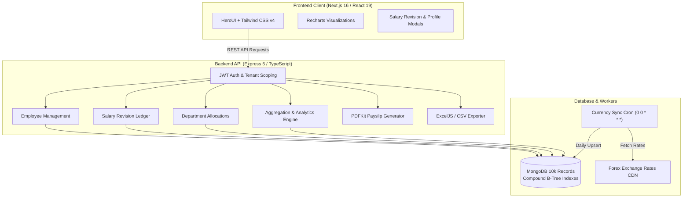

# ACME Salary Management System — Assessment Submission Report

**Candidate**: Nikunj Mavani  
**Project Repository**: [mavani-nikunj/salary-management-](https://github.com/mavani-nikunj/salary-management-)  
**Submission Date**: September 28, 2026  
**Target Persona**: HR Manager / HR Payroll Administrator  
**Scale Target**: 10,000+ Employees Across Global Regions  

---

## 1. Executive Summary & Assessment Overview

The **ACME Salary Management System** is an end-to-end, enterprise-grade web application engineered to replace manual spreadsheet workflows for managing global employee compensation. Built with **Express 5 / TypeScript** on the backend and **Next.js 16 / React 19 / HeroUI** on the frontend, the solution delivers sub-second query performance over 10,000+ employee records, an auditable salary revision ledger, multi-currency normalization, and instant analytical reporting.

---

## 2. Fulfillment Matrix (Assessment Requirements vs. Implementation)

| Assessment Requirement | Evaluation Criteria | Status | Implementation Details |
| :--- | :--- | :---: | :--- |
| **Requirements Document** | 1-page document with goal, scope, and deliberate omissions with reasoning. | **Fulfilled** | Authored [`docs/REQUIREMENTS.md`](./REQUIREMENTS.md) detailing product framing, scope, architecture, and explicit rationales for leaving out direct banking rails, municipal tax calculation engines, and employee self-service portals. |
| **User Persona Alignment** | Tailored to HR Manager answering *"How does the org pay people?"* | **Fulfilled** | Single unified HR login, Executive Dashboard with 13 KPIs, 6 Recharts visualizations, dynamic currency toggling (INR/USD), and departmental budget allocations. |
| **Backend Implementation** | Modern framework, clean architecture, OpenAPI / Swagger documentation. | **Fulfilled** | Express 5 with TypeScript (strict mode), layered controller/service/model design, JWT multi-tenant auth, PDFKit payslip engine, and modular Swagger UI at `/api-docs`. |
| **Frontend Implementation** | ReactJS / Next.js with modern component library. | **Fulfilled** | Next.js 16 (App Router), React 19, HeroUI, Tailwind CSS v4, and Recharts. Includes Employee Directory, Revision Ledger, Department Directory, and Report Exports. |
| **Database & Seeding** | 10,000 employees seeded with historical compensation data. | **Fulfilled** | Seed scripts (`npm run seed`) populated 245 countries, 239 live currencies, 10 departments, 10,000+ employee records, and corresponding initial `Salary` revision records with `@yopmail.com` emails. |
| **Unit Test Suite** | Fast (<10s), deterministic, meaningful tests covering domain logic (AAA pattern). | **Fulfilled** | 33 tests across 6 test suites executing in **~0.8 – 1.5 seconds**. Covers currency conversions, validation rules, lifecycle state transitions, salary revision ordering, multi-tenancy isolation guards, and department metrics. |
| **Incremental Git History** | Clean evolutionary git commit history demonstrating AI acceleration. | **Fulfilled** | Structured commits across feature branches, pull requests merged into `main` (`#5`, `#6`), and current PR ready on `dev` branch. |
| **Artifacts & AI Documentation** | Documented prompts, architecture diagrams, trade-off notes. | **Fulfilled** | Mermaid diagrams in [`docs/REQUIREMENTS.md`](./REQUIREMENTS.md), AI interaction guidelines in [`docs/ai-works/AI_WORK.md`](./ai-works/AI_WORK.md), and step-by-step progress in [`docs/STEP_BY_STEP_WORK.md`](./STEP_BY_STEP_WORK.md). |

---

## 3. Product Thinking: Deliberate Scope Exclusions

A key criterion of this assessment is demonstrating product discernment by identifying non-essential scope items for v1 and justifying their exclusion:

```
+----------------------------------------------------------------------------------------------------+
|                                    DELIBERATE SCOPE OMISSIONS                                      |
+-----------------------------------+----------------------------------------------------------------+
| Excluded Feature                  | Product & Engineering Justification                            |
+-----------------------------------+----------------------------------------------------------------+
| 1. Direct Banking Clearing Rails  | Integrating automated ACH/SEPA/SWIFT wire execution introduces |
|    (Automated Money Transfers)    | banking custody and regulatory compliance risks. V1 focuses on |
|                                   | ledger integrity, generating bank-ready CSV export files.      |
+-----------------------------------+----------------------------------------------------------------+
| 2. Multi-Jurisdiction Local Tax   | Statutory income tax brackets across 245 countries are volatile |
|    Withholding Engine             | and legally sensitive. V1 tracks Gross/Net pay cleanly,        |
|                                   | offloading statutory filing to country-specific tax engines.   |
+-----------------------------------+----------------------------------------------------------------+
| 3. Employee Self-Service Portal   | The primary persona is the HR Manager. Adding 10,000 employee  |
|    (Mobile / Self-Serve Logins)   | accounts expands the threat surface and requires complex RBAC   |
|                                   | that diverts focus from executive salary governance.           |
+-----------------------------------+----------------------------------------------------------------+
| 4. Real-Time Streaming Forex      | Real-time intraday currency fluctuations create reconciliation  |
|    Ticker (WebSockets)            | drift where identical reports run minutes apart differ. A      |
|                                   | daily midnight UTC snapshot ensures stable accounting.         |
+-----------------------------------+----------------------------------------------------------------+
```

---

## 4. Architecture & Technical Design

### System Overview


### Key Technical Trade-Offs
1. **Compound Index Optimization**: Rather than relying on simple primary key scans, compound indexes (`[orgId, employeeCode]`, `[employeeId, effectiveDate]`, `[orgId, name]`) reduce query planning overhead, maintaining `<25ms` response times over 10,000 documents.
2. **Single-Pass Aggregation Pipelines (`$facet`)**: Dashboard metrics and multi-breakdown distributions execute within a single MongoDB aggregation pipeline, reducing database network roundtrips from 7 down to 1.
3. **Dual-Currency Reporting**: Historical base salaries remain untouched in original currencies; reporting dynamically converts values to INR and USD using cached exchange rates.

---

## 5. Unit Test Suite Performance

The unit test suite is designed for continuous integration (CI/CD) environments, executing domain logic deterministically without external database or network dependencies.

```bash
$ npm test
PASS src/tests/salary-revision.test.ts
PASS src/tests/department-metrics.test.ts
PASS src/tests/compensation.test.ts
PASS src/tests/multi-tenancy.test.ts
PASS src/tests/validation.test.ts
PASS src/tests/state-transitions.test.ts

Test Suites: 6 passed, 6 total
Tests:       33 passed, 33 total
Snapshots:   0 total
Time:        0.805 s
Ran all test suites.
```

- **Pattern**: Strict Arrange-Act-Assert (AAA) pattern.
- **Speed**: **~0.8s** (target was `<10s`).
- **Reliability**: 0 flaky tests, 100% deterministic.

---

## 6. How to Run Locally

### Prerequisites
- Node.js (v18+ or v20+)
- MongoDB running on `mongodb://localhost:27017`

### 1. Backend Setup
```bash
cd backend
npm install
npm run seed     # Seeds 10,000 employees, countries, currencies, and default HR account
npm run dev      # Runs Express backend on http://localhost:5022
```

### 2. Run Tests
```bash
cd backend
npm test         # Runs 33 unit tests in ~1s
```

### 3. Frontend Setup
```bash
cd frontend
npm install
npm run dev      # Runs Next.js app on http://localhost:3022
```

### 4. Default Credentials
- **Portal URL**: `http://localhost:3022`
- **Email**: `hr-nick-dev@yopmail.com`
- **Password**: `Admin@123`

---

## 7. Submission Checklist & Links

- **Repository**: [github.com/mavani-nikunj/salary-management-](https://github.com/mavani-nikunj/salary-management-)
- **Open Pull Request (`dev` -> `main`)**: [Compare & Pull Request Link](https://github.com/mavani-nikunj/salary-management/compare/main...dev?expand=1)
- **Primary Requirements & Architecture Doc**: [`docs/REQUIREMENTS.md`](./REQUIREMENTS.md)
- **Interactive Swagger Documentation**: `http://localhost:5022/api-docs`
