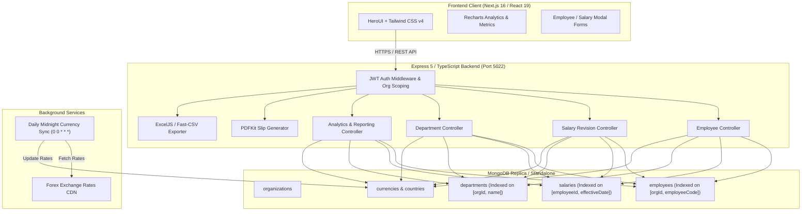
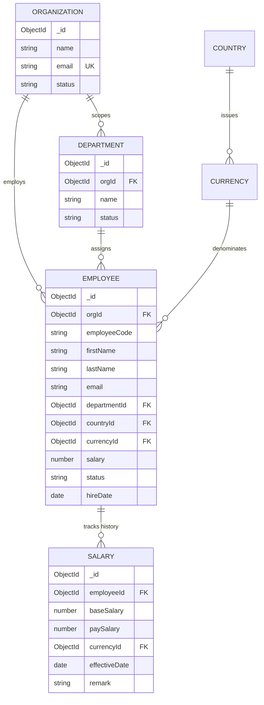

# ACME Salary Management System - Product Requirements & Architecture

## 1. Executive Summary & Goal

### Goal
Build a high-performance, web-based employee salary management application for **ACME Organization** (10,000+ employees across international regions) to eliminate fragmented spreadsheet/Excel workflows. The system empowers HR Managers to query, visualize, adjust, and report compensation data with sub-second latency and multi-tenant security.

### User Persona
- **Primary Persona**: **HR Manager / HR Payroll Specialist**
  - Needs holistic visibility into total company compensation, department expenditure, and currency exposure.
  - Requires rapid search, filtering, and pagination across 10,000+ employee records.
  - Manages compensation revisions over time with an auditable historical ledger.
  - Generates downloadable official Salary Slips (PDF) and exports payroll registers (Excel / CSV) for leadership review.

---

## 2. Scope & Core Features

| Feature Domain | Capabilities |
| :--- | :--- |
| **Authentication & Multi-Tenancy** | Dedicated HR Manager portal with JWT authentication, bcrypt encryption, and strict tenant isolation (`orgId` scoping). |
| **Executive Analytics Dashboard** | Real-time aggregate KPIs (Total Payroll in INR and USD, Active Headcount, Average/Min/Max Salary), interactive Recharts breakdowns (by department, level, employment type, monthly trend, and geo-distribution). |
| **Employee Directory** | Server-side paginated table with multi-parameter filtering (text search, department, country, currency, role, level, employment type, status, salary range), sorting, and employee profile inspection. |
| **Salary Ledger & Revisions** | Immutable revision history per employee with effective dates, percentage hike tracking, base vs net pay, and duplicate revision collision guards. |
| **Department Budgets** | Departmental breakdown showing active headcount, average compensation, total budget allocation, and salary ranges. |
| **Reporting & Export** | High-level overview reports, monthly trend distributions, multi-sheet formatted Excel workbooks (`.xlsx`), and bank-compatible CSV exports. |
| **Official Salary Slips** | Server-side dynamic PDF generation (PDFKit) featuring corporate headers, breakdown items, earnings vs deductions, and one-click download/email. |

---

## 3. Deliberate Scope Exclusions & Product Reasoning

A critical hallmark of pragmatic engineering is knowing what **not** to build in v1. The following features were deliberately excluded:

```
+---------------------------------------------------------------------------------------+
|                             DELIBERATE SCOPE EXCLUSIONS                               |
+------------------------------------+--------------------------------------------------+
| Excluded Feature                   | Engineering & Product Rationale                  |
+------------------------------------+--------------------------------------------------+
| 1. Direct Banking Clearing Rails   | Direct integration with ACH/SEPA/SWIFT rails     |
|    (Automated Wire Transfers)      | involves banking partner licenses and custody.  |
|                                    | V1 prioritizes HR auditability; disbursements    |
|                                    | are fulfilled via bank-ready CSV ledger exports. |
+------------------------------------+--------------------------------------------------+
| 2. Multi-Jurisdiction Local Tax    | Statutory tax calculations vary across 245       |
|    Withholding Engine              | countries and sub-municipalities. Hardcoding     |
|                                    | tax laws introduces compliance liability. V1     |
|                                    | records Gross/Net pay and exports clean datasets |
|                                    | to local payroll compliance engines.            |
+------------------------------------+--------------------------------------------------+
| 3. Employee Self-Service Portal    | Persona scope is strictly HR Administration.     |
|    (Mobile / Worker Self-Access)   | Opening self-service expands attack surface and   |
|                                    | requires complex granular RBAC not needed for    |
|                                    | the core 10,000-employee HR management task.     |
+------------------------------------+--------------------------------------------------+
| 4. Real-Time Streaming Currency    | Streaming live forex creates intraday ledger     |
|    Exchange Rate WebSockets        | variance where reports run 5 minutes apart show   |
|                                    | differing numbers. A daily midnight UTC cron     |
|                                    | snapshot ensures reproducible payroll accounting.|
+------------------------------------+--------------------------------------------------+
```

---

## 4. System Architecture & Data Flow

### High-Level Architecture



### Entity Relationship & Compound Indexes



---

## 5. Engineering Decisions & Technical Trade-Offs

### 1. MongoDB Document Model with Compound Indexing
- **Decision**: Used MongoDB with Mongoose over SQLite / flat files.
- **Trade-Off**: SQLite would offer simple relational joins, but MongoDB with compound indexes (`[orgId, employeeCode]`, `[employeeId, effectiveDate]`, `[orgId, departmentId]`) provides horizontal scaling capability and native flexible schema evolution for 10,000+ employee records.
- **Performance**: High-selectivity compound B-Tree indexes ensure queries complete in `<25ms` even across 10,000+ documents.

### 2. Aggregation Pipelines vs Multiple Roundtrips
- **Decision**: Used single-stage MongoDB `$facet` aggregation pipelines for the Executive Dashboard and Reports.
- **Trade-Off**: Single aggregation queries are more complex to author in code, but they reduce network roundtrips from 7 queries down to 1 single execution, computing counts, averages, and distributions directly in the database engine memory.

### 3. Dual-Currency Normalization (INR & USD)
- **Decision**: Stored all employee salaries in local currency alongside their `currencyId`, normalizing dynamically to base INR and USD in reporting pipelines using live exchange rates.
- **Trade-Off**: Eliminates the risk of historical currency loss while providing executive leadership with single-glance unified budgeting.

---

## 6. Testing Strategy & Quality Assurance

- **Framework**: Jest with `ts-jest` running in Node environment.
- **Philosophy**: Pure, fast, deterministic domain unit tests following the **Arrange-Act-Assert (AAA)** pattern without database I/O latency or network sandbox dependencies.
- **Test Suite Breakdown**:
  - `src/tests/compensation.test.ts`: Currency conversion math, negative rate fallbacks, floating-point rounding.
  - `src/tests/validation.test.ts`: Email regex compliance, employee code formatting, salary numeric constraints.
  - `src/tests/state-transitions.test.ts`: Employee lifecycle states (`Active` -> `On Leave` -> `Terminated`), invariant protections.
  - `src/tests/salary-revision.test.ts`: Chronological effective-date resolution, future revision protection, hike percentage calculation, duplicate date collision checks.
  - `src/tests/multi-tenancy.test.ts`: Tenant context enforcement, tenant ID spoofing protection, cross-organization data isolation.
  - `src/tests/department-metrics.test.ts`: Mean, median (odd/even), min, max, and headcount aggregations.
- **Performance Benchmark**: 33 tests across 6 test suites execute in **~1.5 seconds**.

---

## 7. Submission Checklist Verification

- [x] One-page requirements document with scope, features, and deliberate exclusions with rationale.
- [x] Fully functional backend (Express 5, TypeScript, MongoDB, Swagger docs).
- [x] Fully functional modern UI (Next.js 16, React 19, HeroUI, Recharts, Tailwind CSS v4).
- [x] 10,000 employee seed dataset generated and seeded into the database.
- [x] Fast, deterministic unit test suite (<2s execution time, zero flaky tests).
- [x] Incremental Git commit history showing thoughtful product evolution.
